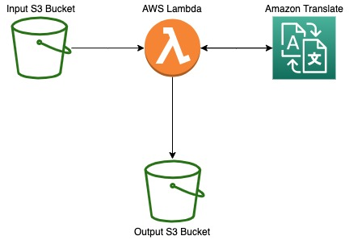

# Serverless Document Translation

## Summary
This solution allows users to create an automatic pipeline to translate text documents from one language to another. You can use any of the supported [*language pairs*](https://docs.aws.amazon.com/translate/latest/dg/what-is.html) offered by Amazon Translate.

## Architecture Component Walkthrough

The workflow for this app is very simple. It only involves three AWS services - [Amazon S3](https://aws.amazon.com/s3/), [AWS Lambda](https://aws.amazon.com/lambda/) and [Amazon Translate](https://aws.amazon.com/translate/). Amazon S3 is used to store the documents. AWS Lambda function gets triggered by "ObjectCreate (All)" operations on input S3 bucket (location). AWS Lambda extracts text from the source document and makes API call to Amazon Translate to translate the text and create a new document with translated text. At the end, the Lambda function uploads the translated document to the output S3 bucket (location).

## References
[Translating documents with Amazon Translate, AWS Lambda, and the new Batch Translate API](https://aws.amazon.com/blogs/machine-learning/translating-documents-with-amazon-translate-aws-lambda-and-the-new-batch-translate-api/)

## License
This library is licensed under the MIT-0 License. See the LICENSE file.
